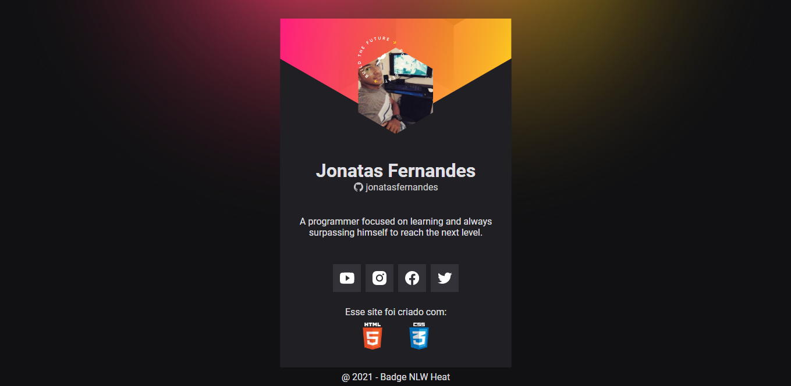
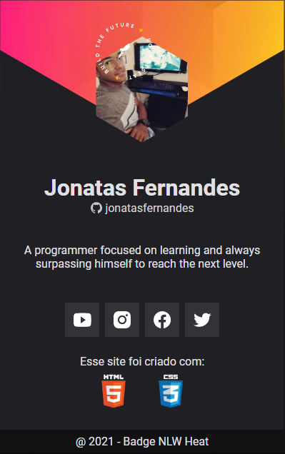
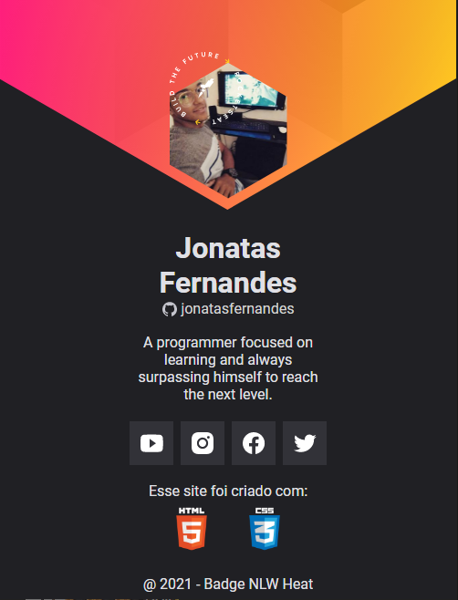

# Git NLW-Heat versão Web

* Esse é um projeto baseado no desafio feito no NLW-Heat 2021 realizado pela Rocketseat.
* A intenção é ter um crachá Web que tenha links para as redes sociais e Github, além de ter sua foto do perfil direto do Github.
* Fiz algumas alterações comparado ao original, mas, ficou melhor distribuido com GRID.

* Link do projeto no Figma: https://www.figma.com/file/S96VXAw6ibXZY0w64jWnuc/%5BNLW-Heat---Mission%3A-Origin%5D-DoWhile2021-(Community)?node-id=0%3A1

# O resultado foi esse:

